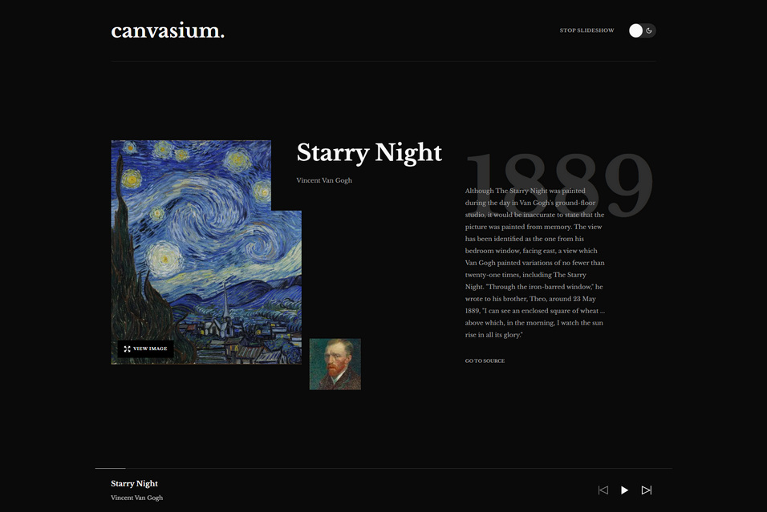

# Canvasium — Discover Iconic Paintings

**Canvasium** is a refined gallery slideshow web app that lets you explore famous art pieces in style. Navigate effortlessly through a curated collection of masterpieces using smooth transitions and a minimalist UI.

## 🌐 Live Demo

Explore Canvasium live 👉 [canvasium.vercel.app](https://canvasium.vercel.app)

## 📚 Challenge

This project was built for the Frontend Mentor - Galleria slideshow site challenge.
Frontend Mentor challenges help you improve your coding skills by building realistic projects.

👉 [View the challenge here](https://www.frontendmentor.io/challenges/galleria-slideshow-site-tEA4pwsa6)

## ✨ Features

| Function              | Description                                                         |
| :-------------------- | :------------------------------------------------------------------ |
| Dark Mode             | Seamless light/dark theme toggle.                                   |
| Masonry Layout        | A dynamic grid system which positions each item based on its height |
| Slideshow             | Automatic and manual navigation through artworks                    |
| Accessible Navigation | Arrow keys to navigate, spacebar to pause/resume slideshow          |
| Responsive Design     | Optimized for desktop, tablet, and mobile.                          |
| Fluid Animations      | Beautiful transitions powered by Framer Motion.                     |

## 🛠 Tech Stack

| Tech Stack                                      | Description                               |
| :---------------------------------------------- | :---------------------------------------- |
| [Next.js v15](https://nextjs.org/)              | React framework with SSR support          |
| [TypeScript](https://www.typescriptlang.org/)   | Strongly typed JavaScript                 |
| [Tailwind CSS v4](https://tailwindcss.com/)     | Utility-first styling                     |
| [shadcn/ui](https://ui.shadcn.com/)             | Accessible and customizable UI components |
| [Framer Motion](https://www.framer.com/motion/) | Smooth animations and transitions         |

## 🚀 Getting Started

**Fork this repo**
You can fork this repo by clicking the fork button in the top right corner of this page.

**Clone on your local machine**

```bash
git clone https://github.com/engrjvramos/canvasium.git
```

**Navigate to project directory**

```bash
cd canvasium
```

**Create a new branch**

```bash
git checkout -b my-new-branch
```

**Install dependencies**

```bash
pnpm install
```

**Run the development server**

```bash
pnpm run dev
```

Visit [http://localhost:3000](http://localhost:3000) to see the app in action.

## 📷 Screenshots




## 🤝 Contributing

Contributions are welcome! If you’d like to improve **Canvasium**, please fork the repo and submit a PR.

## 📄 License

This project is open-source under the MIT License. Feel free to fork, modify, and build upon it.
