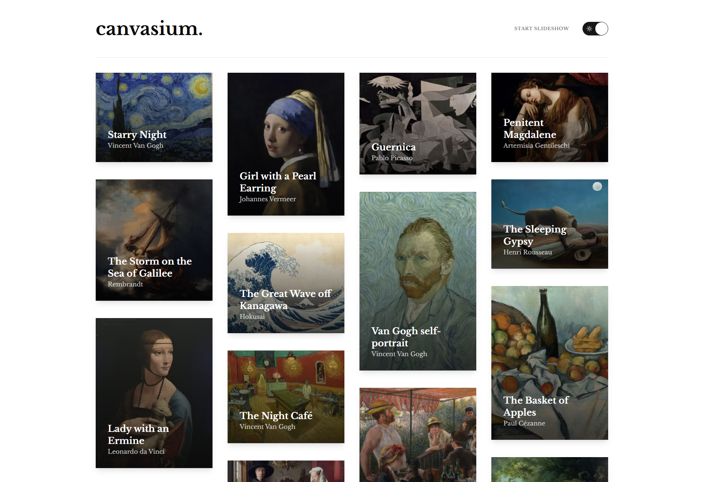
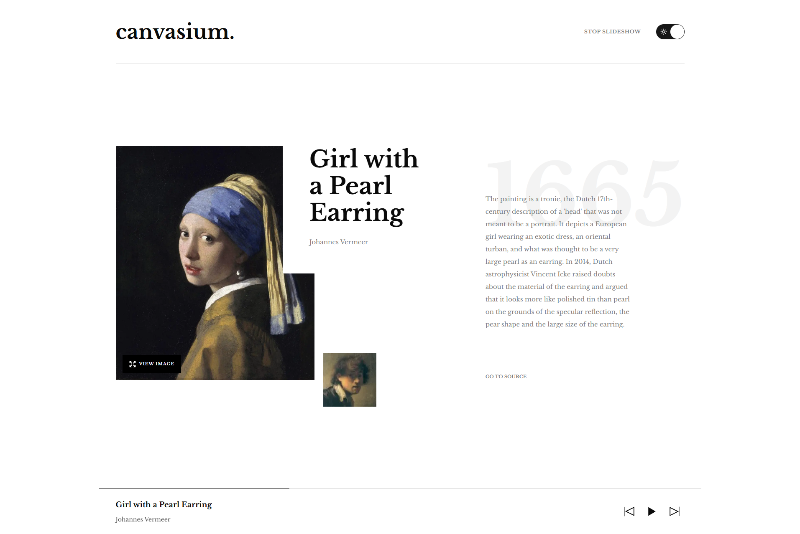
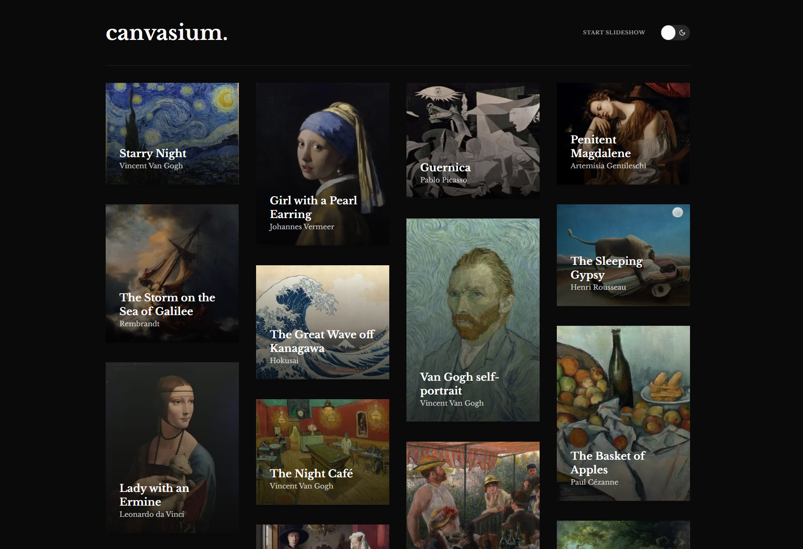

## 🎨 Canvasium

**Canvasium** is an iconic paintings gallery featuring smooth slideshow transitions, keyboard navigation, and light/dark theme support — all built using modern frontend tools.

## 🖼️ Project Description

Canvasium is a visually rich and interactive gallery of timeless artwork. Designed with accessibility and polish in mind, it allows users to explore iconic paintings with a minimalist UI and immersive slideshow experience.

## ⚙️ Tech Stack

- [Next.js](https://nextjs.org/)
- [Tailwind CSS](https://tailwindcss.com/)
- [TypeScript](https://www.typescriptlang.org/)
- [shadcn/ui](https://ui.shadcn.com/)
- [Framer Motion](https://www.framer.com/motion/)

## ✨ Features

- ⌨️ **Keyboard navigation**: Arrow keys to navigate, spacebar to pause/resume slideshow.
- 🌗 **Light/Dark mode**: Toggle between themes for better visual comfort.
- 🖼️ **Slideshow functionality**: Automatic and manual navigation through artworks.
- 🎞️ **Smooth animations**: Powered by Framer Motion for an elegant user experience.

## 🚀 Getting Started

### Prerequisites

Ensure you have **Node.js** and **pnpm** installed:

```bash
npm install -g pnpm
```

### Installation

```bash
pnpm install
pnpm run dev
```

Visit `http://localhost:3000` to view it locally.

## 🌐 Live Site

Deployed on Vercel: [https://canvasium.vercel.app](https://canvasium.vercel.app)

## 🎨 Credits

Design by [Frontend Mentor](https://www.frontendmentor.io/).

## 📸 Screenshots

### Light Mode





### Dark Mode




